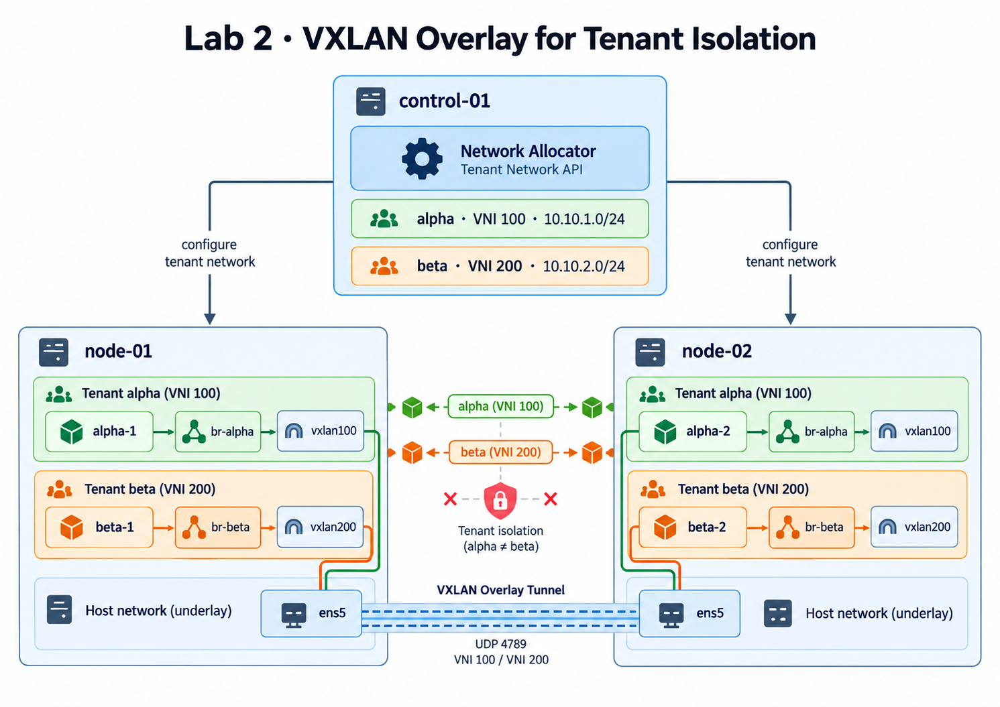

# Isolating Tenants with a VXLAN Overlay Network

## Overview

In the **Building the Control Plane and Registering Agents** lab, you built a cluster where every node registers with the control plane and reports its free capacity. So far, though, a node is just a box with spare room. Before anyone runs containers on it, there's a harder question: **who can talk to whom?**

Your cluster is shared by several tenants. Tenant `alpha` might run a web server on `node-01` and its database on `node-02`. Those two containers must reach each other as if they sat on the same office network, even though they're on different machines. Meanwhile tenant `beta` runs its own containers on the very same machines, and must never reach `alpha`'s containers, not even when they share a node.

Think of two office buildings (the nodes) shared by several companies (the tenants). Each company has rooms in both buildings. Each company gets its own **private network switch** on every floor it rents, plus its own **dedicated cable**, labeled with the company's number, running through the buildings' shared cable duct to its switch in the other building. Two companies' cables run through the same duct, but each plugs only into its own company's switches, so their traffic never meets.

In this lab you build exactly that:

- a **Linux bridge** per tenant on every node: the private switch;
- a **VXLAN tunnel** per tenant: the labeled cable, carried inside the normal network between the nodes;
- control-plane logic that hands each tenant a **VXLAN number and a subnet**, and tells every agent to build its part.

This is the "per-tenant VXLAN bridge for isolation" from the final exam's agent requirements. The container-lifecycle lab that follows launches every tenant container onto these networks.

## Architecture



Each node has one bridge per tenant. Each bridge has a VXLAN interface plugged in, which wraps the tenant's traffic in UDP packets and sends them over the real network card (`ens5`) to the other node. There, the matching VXLAN interface unwraps them into the same tenant's bridge.

## Before you start

### Get AWS credentials

Open **Cloud Tray → Credentials** and copy the **AccessKey** and **SecretKey**. Then:

**workspace**
```bash
aws configure
```

Paste the two keys, enter `ap-southeast-1` as the region, and press Enter for the output format. Confirm AWS accepts them:

**workspace**
```bash
aws sts get-caller-identity
aws ec2 describe-availability-zones --query 'AvailabilityZones[0].ZoneName' --output text
```

The second command must print `ap-southeast-1a`. If it says `AuthFailure`, wait a minute and run it again.

### Get the lab code

**workspace**
```bash
cd ~/code
git clone -b lab-02-start --depth 1 https://github.com/poridhioss/ecs-lab.git
cd ecs-lab && ls
```

<!-- UNTESTED -->
```
agent  control-plane  infra  scripts
```

This branch contains the finished code from the **Building the Control Plane and Registering Agents** lab, plus two updated `requirements.txt` files: the agent now also needs FastAPI, Uvicorn and the Docker SDK, and the control plane needs `httpx`. In this lab you add to `control-plane/main.py` and `agent/agent.py`, and write a new `agent/network.py`.

### Check for leftovers

**workspace**
```bash
aws ec2 describe-vpcs --filters "Name=tag:Name,Values=ecs-lab-vpc" --query 'Vpcs[].VpcId' --output text
bash scripts/preflight.sh
```

The first command should print nothing, and the second `clean: no leftovers from an earlier session`. If a VPC ID was printed, the script deletes it and everything in it.

## Catch-up

Every lab starts on brand-new machines, so first rebuild where the previous lab ended: the control plane, Postgres, Temporal, and an agent registered on each node.

**workspace**
```bash
cd ~/code/ecs-lab/infra/terraform && terraform init && terraform apply -auto-approve
```

When it prints `Apply complete! Resources: 14 added`, run the catch-up script. It waits for the machines to finish installing Docker, deploys everything with `scripts/push.sh all`, and checks the result:

**workspace**
```bash
cd ~/code/ecs-lab && time bash scripts/catchup.sh
```

<!-- UNTESTED -->
```
== waiting for first-boot setup (Docker install) on every machine ==
control-01 ready
node-01 ready
node-02 ready
== deploying everything ==
...
== verifying ==
== control plane http://52.77.x.x:8000 ==
ok: /health
== agents (waiting up to 60s for 2 online) ==
node-01  online  10.0.1.21  cpu_free=1.98/2  mem_free=3290 MiB
node-02  online  10.0.1.22  cpu_free=1.99/2  mem_free=3301 MiB
ok: 2 agents online
== Temporal UI ==
ok: http://52.77.x.x:8233/
ALL CHECKS PASSED
```

Then set the two variables you'll use throughout the lab:

**workspace**
```bash
CONTROL=$(terraform -chdir=infra/terraform output -raw control_public_ip)
TOKEN=$(terraform -chdir=infra/terraform output -raw agent_token)
echo "control plane: $CONTROL"
```

If you open a new terminal later, run these three lines again from `~/code/ecs-lab`.

## Concepts

### Same subnet, same switch

Two containers in the same subnet (say `10.10.1.10` and `10.10.1.140`) don't use a router to reach each other. The sender asks the whole local network "who has `10.10.1.140`?" (an **ARP** broadcast), gets back a hardware (MAC) address, and sends the packet straight there. That only works if both containers are plugged into the **same switch**, the same *layer 2* network.

On Linux, a **bridge** is a virtual switch. A Docker network of type `bridge` is exactly that: a bridge, a subnet, and a gateway address on the bridge. But a bridge lives on one machine. Containers on `node-01`'s bridge can't send ARP broadcasts to containers on `node-02`.

### VXLAN: a cable inside the network

**VXLAN** (Virtual eXtensible LAN) solves this. A VXLAN interface takes every Ethernet frame the bridge hands it, wraps it inside a **UDP packet** (port **4789**), and sends that packet to another node's real IP address. The other node's VXLAN interface unwraps it and hands the original frame to its bridge. To the containers, the two bridges behave like one switch.

Each wrapped packet carries a 24-bit number, the **VNI** (VXLAN Network Identifier). Tenant `alpha` uses VNI `100` and `beta` uses `200`. A node receiving a VNI 100 packet hands it only to `vxlan100`, which is plugged only into `br-alpha`. Different VNIs never mix, even though they travel over the same network between the same two machines.

The wrapping adds 50 bytes to every packet. The VPC network between EC2 machines carries packets of up to 9001 bytes ("jumbo frames"), and containers send at most 1500, so there's plenty of room. You'll check this with a full-size ping.

### Who gets which IP address

This lab has two separate sets of IP addresses, and it's easy to mix them up.

**1. Node addresses, from the VPC subnet `10.0.1.0/24`.** These belong to the EC2 machines. Terraform created this subnet inside the VPC, and AWS gave each machine its fixed address from it: `node-01` is `10.0.1.21` and `node-02` is `10.0.1.22`. They're real network cards on a real network, and the VXLAN tunnel uses them: tunnel packets travel from `10.0.1.21` to `10.0.1.22`.

**2. Container addresses, from a tenant subnet.** Each tenant gets its own subnet: `alpha` gets `10.10.1.0/24` and `beta` gets `10.10.2.0/24`. AWS knows nothing about these. The **control plane** chooses them (the `allocate_tenant` function you'll write in Step 1), and the **agent** on each node passes them to that node's Docker when it creates the tenant's Docker network. Tenant containers get their addresses from them. These addresses exist only on the tenant's bridges and inside its tunnel. The VPC never sees them directly, because they always travel wrapped inside a tunnel packet between node addresses.

| | VPC subnet | Tenant subnet (alpha's) |
|---|---|---|
| Addresses | `10.0.1.0/24` | `10.10.1.0/24` |
| Chosen by | Terraform | The control plane |
| Made real by | AWS, as part of the VPC | Docker on each node, as the Docker network `alpha` |
| Used by | The EC2 machines (`10.0.1.21`, `10.0.1.22`) | `alpha`'s containers (`10.10.1.10`, `10.10.1.140`) |

The two look alike (`10.0.1.` vs `10.10.1.`), so read carefully: everything in the rest of this section is about **tenant** subnets.

Here is how the two sets fit together for tenant `alpha`:

```
        node-01  (node address 10.0.1.21)               node-02  (node address 10.0.1.22)
 ┌──────────────────────────────────────┐        ┌──────────────────────────────────────┐
 │  alpha-1                             │        │                             alpha-2  │
 │  10.10.1.10                          │        │                         10.10.1.140  │
 │     │                                │        │                                │     │
 │  br-alpha  (bridge IP 10.10.1.1)     │        │     (bridge IP 10.10.1.129)  br-alpha│
 │     │                                │        │                                │     │
 │  vxlan100 ─────── ens5 ══════════ tunnel, UDP 4789 ══════════ ens5 ─────── vxlan100   │
 └──────────────────────────────────────┘        └──────────────────────────────────────┘
          one switch, one subnet for alpha: 10.10.1.0/24, spread over both nodes
```

**Why both nodes share one subnet.** A **subnet** is a block of addresses that all sit on the same local network. `10.10.1.0/24` means "every address that starts with `10.10.1.`", which is 256 addresses, `10.10.1.0` to `10.10.1.255`. (The `/24` says the first 24 bits, the first three numbers, are fixed.) The tunnel joins `alpha`'s two bridges into **one** switch, so all of `alpha`'s containers are on one local network, on whichever node they run. One local network means one subnet. That's what lets `alpha-1` reach `alpha-2` directly, as described in "Same subnet, same switch" above.

**Problem 1: two nodes could hand out the same address.** When an `alpha` container starts, the Docker engine *on that node* picks a free address for it from the Docker network `alpha`, that is, from `alpha`'s tenant subnet `10.10.1.0/24` (never from the VPC's `10.0.1.0/24`). Each node has its own Docker network `alpha` with its own address bookkeeping, and it only knows about the containers on that node; it can't see the other node's. Suppose both nodes picked from the whole tenant subnet:

- `node-01` starts an `alpha` container. Docker picks the first free address: `10.10.1.2`.
- `node-02` starts an `alpha` container. Its Docker also sees `10.10.1.2` as free (nothing on *its* bridge uses it), and picks it too.
- Now two containers on the same switch share one address. Packets meant for one arrive at the other, at random.

**Fix: each node gets its own half of the subnet.** A `/25` is half of a `/24`: 128 addresses instead of 256. `10.10.1.0/25` covers `.0` to `.127`, and `10.10.1.128/25` covers `.128` to `.255`. Each node's Docker is told to pick only from its own half (Docker calls this the network's **IP range**), so the two can never collide. The cost: each node can run at most about 126 containers per tenant, plenty for this course.

**Problem 2: each node needs its own gateway address.** First, what a gateway is. When a container sends a packet to an address *outside* its tenant subnet, for example to download something from the internet, it can't deliver it directly. It hands the packet to its **gateway**, which forwards it on.

On a Docker network, the gateway is the node itself. A Linux bridge does two jobs at once: it's the **switch** the containers plug into, and it's also the **node's own connection** to that switch. The IP address Docker gives the bridge belongs to the node, as a member of the tenant's network. Containers use that address as their gateway, and the node forwards their outside traffic.

Now remember that the tunnel joins `alpha`'s two bridges into **one** switch. So both nodes are members of `alpha`'s network, each through its own `br-alpha`. On that single switch there are four addresses:

| Member of alpha's network | Address |
|---|---|
| `alpha-1` (container on node-01) | `10.10.1.10` |
| `alpha-2` (container on node-02) | `10.10.1.140` |
| node-01, through its `br-alpha` | `10.10.1.1` |
| node-02, through its `br-alpha` | `10.10.1.129` |

Why can't both nodes use `10.10.1.1`? When `alpha-1` needs its gateway, it broadcasts "who has `10.10.1.1`?". The broadcast travels through the tunnel, so **both** nodes hear it, and both would answer. `alpha-1` would then send its outside traffic to whichever answer arrived last, sometimes node-02 on the far side of the tunnel. With different addresses, each container has exactly one gateway: its own node. Each node uses the first address of its half: `10.10.1.1` on `node-01`, `10.10.1.129` on `node-02`.

Putting it together, this is what the control plane gives each node:

| Tenant (subnet) | node-01: IP range and gateway | node-02: IP range and gateway |
|---|---|---|
| alpha (`10.10.1.0/24`) | `10.10.1.0/25`, gateway `10.10.1.1` | `10.10.1.128/25`, gateway `10.10.1.129` |
| beta (`10.10.2.0/24`) | `10.10.2.0/25`, gateway `10.10.2.1` | `10.10.2.128/25`, gateway `10.10.2.129` |

`beta` follows the same pattern in its own subnet, `10.10.2.0/24`. It has nothing to do with `alpha`'s: different addresses, different bridges, a different tunnel. Later in this lab you'll give the test containers fixed addresses from each node's half: `.10` on `node-01`, `.140` on `node-02`.

This design rests on two assumptions, both true in this course: there are exactly **two** nodes (a third would need the subnets split into quarters), and each tenant needs **one** `/24` (at most 256 addresses across the cluster).

### Telling the tunnel where its peers are

The tunnel wraps a frame and sends it to *another node*. But which node? That's what the tunnel's **peers** and its **FDB** are for.

**A peer** is another node that also carries the tenant's network: the place the tunnel leads to. With two nodes, each node has exactly one peer, named by its VPC address. `node-01`'s peer is `node-02` at `10.0.1.22`, and `node-02`'s peer is `node-01` at `10.0.1.21`.

**The FDB** (forwarding database) is a lookup table that answers: "a frame for this hardware (MAC) address, where do I send it?". Every switch keeps one; on physical switches it's often called the MAC address table. It isn't a file, and it isn't in Docker or in Postgres: it's a table in the **Linux kernel's memory** on each node, attached to a network device. That's also why it's gone after a reboot. Each node has two FDBs that matter here:

- **`br-alpha`'s FDB** answers "this MAC is behind which port of the switch?" (a container's port, or the `vxlan100` port). The bridge fills it in by itself as frames pass through.
- **`vxlan100`'s FDB** answers "this MAC is on which *node*: to which node address should I send the wrapped packet?". This is the one the agent edits.

You can read and change it with the `bridge` command: `bridge fdb show dev vxlan100` lists the entries, and `bridge fdb append` / `bridge fdb del` add and remove them. The agent adds one entry per peer:

```
bridge fdb append 00:00:00:00:00:00 dev vxlan100 dst 10.0.1.22
```

A normal FDB entry names one MAC address. The **all-zeros** address is a **catch-all**: "any frame I have no specific entry for, send to `10.0.1.22`". The tunnel is created with `nolearning`, which means it never adds specific entries on its own, so the catch-all handles every frame. With more nodes there would be one catch-all per peer, and the tunnel would send a copy to each of them. Many VXLAN setups find their peers automatically using network multicast, but AWS VPCs don't support multicast. That's why the control plane, which knows every node's address, tells each agent its peers.

**Following one ping** from `alpha-1` (`10.10.1.10`, on node-01) to `alpha-2` (`10.10.1.140`, on node-02):

1. `alpha-1` doesn't know `alpha-2`'s MAC address yet, so it broadcasts to its switch: "who has `10.10.1.140`?" (an ARP request).
2. `br-alpha` on node-01 sends the broadcast out of all its ports, including `vxlan100`.
3. `vxlan100` looks in its FDB, finds no specific entry, and uses the catch-all `dst 10.0.1.22`. It wraps the frame in a UDP packet tagged VNI 100 and sends it from `10.0.1.21` to `10.0.1.22`, port 4789.
4. node-02 receives the packet, sees VNI 100, and passes it to its own `vxlan100`, which unwraps it and hands the original frame to `br-alpha`. `alpha-2` hears the question and replies with its MAC address.
5. The reply comes back the same way, through node-02's catch-all `dst 10.0.1.21`.
6. Now `alpha-1` sends the ping itself, to `alpha-2`'s MAC address. Again there's no specific entry, so it goes through the catch-all to node-02.

Without the catch-all on node-01, step 3 has nowhere to send the frame and the ping dies. You'll cause exactly that in the break-it exercise.

### Three layers of isolation

How do we know `beta` can never reach `alpha`?

1. **Separate switches.** `alpha`'s containers and `beta`'s are on different bridges, so they never share a broadcast domain.
2. **Separate tunnels.** VNI 100 traffic only ever reaches `br-alpha` bridges.
3. **No routing between tenants.** A `beta` container could still try sending to `10.10.1.140` through its gateway, which is the node itself, and the node *does* have a route to `10.10.1.0/24` (via `br-alpha`). What stops it is Docker: it installs firewall rules that drop traffic between different Docker networks. Without that rule, the node would happily route `beta`'s packets into `alpha`'s network.

### Safe to repeat: describing the goal, not the steps

There are two ways to ask for a warm room:

- **"Heat for 10 minutes"** is an *action*. Ask twice and the room overheats. Ask after a power cut and you don't know where you'll end up.
- **"Set the thermostat to 22°C"** is a *goal*. Ask twice and nothing changes. Ask after a power cut and the room gets back to 22°C.

The control plane talks to agents the second way. `PUT /networks/alpha` doesn't say "run these commands". It says "on this node, alpha's network should look like *this*": this subnet, this half, this gateway, these peers. The agent then walks through a checklist and only acts where the node doesn't match yet:

| Check | 1st request (empty node) | Same request again | After someone deleted the FDB entry |
|---|---|---|---|
| Docker network `alpha` exists? | no → create it | yes → skip | yes → skip |
| `vxlan100` exists? | no → create it | yes → skip | yes → skip |
| Plug `vxlan100` into `br-alpha`, switch it on | do it | do it (harmless) | do it (harmless) |
| Catch-all entry for peer node-02 (`10.0.1.22`) in `vxlan100`'s FDB? | no → add it | yes → skip | **no → add it** |
| The agent replies with these `changes` | 3 items | `[]` | `["added peer 10.0.1.22"]` |

Without the checks, repeating a request would break things: `ip link add vxlan100` fails with `File exists`, Docker refuses to create a second network named `alpha`, and a second FDB entry for the same peer makes every broadcast go to that peer twice.

A request that gives the same result however many times you send it is called **idempotent**. You'll rely on that three times:

1. **Repeating safely.** In Step 5 you send the `alpha` request a second time and see `[]` from both nodes: nothing to do.
2. **Repairing.** In the break-it exercise you delete an FDB entry by hand, send the same request again, and watch the agent add back just that entry. A node reboot is similar: the Docker network survives a reboot, but `vxlan100` doesn't, and the same request re-creates only the tunnel.
3. **Catching up.** The next lab starts on brand-new machines with an empty database, so there's no saved network to restore. Instead, its catch-up script sends the same two requests you send by hand in this lab, `POST /tenants/alpha/network` and `.../beta/network`. On empty nodes every check says "missing", so everything gets built again, by the same code. Allocation is idempotent too: `alpha` is created first, so it gets VXLAN 100 and `10.10.1.0/24` again.

## Steps

### Step 1: Allocate tenant networks in the control plane

Open `control-plane/main.py` in VS Code.

**1a. Imports.** Replace the import lines at the top of the file (from `import asyncio` down to `from pydantic import BaseModel`) with:

```python
import asyncio
import ipaddress
import logging
import os
import re
import secrets
from contextlib import asynccontextmanager

import httpx
import psycopg
from fastapi import Depends, FastAPI, Header, HTTPException
from psycopg.rows import dict_row
from pydantic import BaseModel
```

New: `ipaddress` to split subnets, `re` to check tenant names, and `httpx` to call the agents.

**1b. The tenants table.** Inside the `SCHEMA` string, after the closing `);` of the `agents` table and before the closing `"""`, add:

```python

CREATE TABLE IF NOT EXISTS tenants (
    tenant_id  TEXT PRIMARY KEY,
    vxlan_id   INTEGER NOT NULL UNIQUE,
    subnet     TEXT NOT NULL UNIQUE,
    created_at TIMESTAMPTZ NOT NULL DEFAULT now()
);
```

The control plane already runs `SCHEMA` at startup with `CREATE TABLE IF NOT EXISTS`, so the new table is created the next time it starts. `UNIQUE` on `vxlan_id` and `subnet` guarantees two tenants can never share either.

**1c. Allocation and the endpoint.** Add this at the end of the file:

```python


# ---------- tenant networks ----------

# Every node owns one half of every tenant subnet, so two nodes never give out
# the same container IP: node-01 gets x.x.x.0/25, node-02 gets x.x.x.128/25.
NODE_SLOTS = {"node-01": 0, "node-02": 1}
AGENT_PORT = 5050
# Linux interface names are at most 15 characters: "br-" + 12 is the limit.
TENANT_ID = re.compile(r"^[a-z][a-z0-9]{0,11}$")


def allocate_tenant(tenant_id):
    """Give a tenant the next free VXLAN ID and /24. Asking again returns the same ones."""
    with db() as conn:
        conn.execute(
            """INSERT INTO tenants (tenant_id, vxlan_id, subnet)
               SELECT %(tenant_id)s, n * 100, '10.10.' || n || '.0/24'
               FROM (SELECT COALESCE(MAX(vxlan_id) / 100, 0) + 1 AS n FROM tenants) AS alloc
               ON CONFLICT (tenant_id) DO NOTHING""",
            {"tenant_id": tenant_id},
        )
        return conn.execute(
            "SELECT tenant_id, vxlan_id, subnet FROM tenants WHERE tenant_id = %s", (tenant_id,)
        ).fetchone()


def node_slice(subnet, node_id):
    """This node's half of the tenant subnet, and its gateway (the first address in it)."""
    half = list(ipaddress.ip_network(subnet).subnets(new_prefix=25))[NODE_SLOTS[node_id]]
    return str(half), str(next(half.hosts()))
```

- **`allocate_tenant`** is one SQL statement. The inner `SELECT` finds the next number `n` (1 for the first tenant, 2 for the second...), and the tenant gets VXLAN ID `n × 100` and subnet `10.10.n.0/24`. `ON CONFLICT (tenant_id) DO NOTHING` means an existing tenant keeps what it has, so the function is idempotent: `alpha` is always `100` and `10.10.1.0/24`, however many times you ask.
- **`node_slice`** splits the `/24` into two `/25` halves with Python's `ipaddress` module and picks this node's half. Its first usable address (`.1` or `.129`) becomes the node's gateway.
- **`NODE_SLOTS`** fixes which half each node owns, the same way Terraform fixes each machine's IP. Adding a third node would mean adding it here and splitting subnets into quarters.

Now the endpoint, also at the end of the file:

```python


@app.post("/tenants/{tenant_id}/network")
def create_tenant_network(tenant_id: str):
    if not TENANT_ID.match(tenant_id):
        raise HTTPException(status_code=400, detail="tenant_id: lowercase letters and digits, max 12")
    tenant = allocate_tenant(tenant_id)

    with db() as conn:
        online = conn.execute(
            "SELECT node_id, private_ip FROM agents WHERE status = 'online' ORDER BY node_id"
        ).fetchall()
    nodes = [n for n in online if n["node_id"] in NODE_SLOTS]

    # Tell every node to build its part of the network, and where its peers are.
    results = {}
    for node in nodes:
        ip_range, gateway = node_slice(tenant["subnet"], node["node_id"])
        spec = {
            "vxlan_id": tenant["vxlan_id"],
            "subnet": tenant["subnet"],
            "ip_range": ip_range,
            "gateway": gateway,
            "peers": [n["private_ip"] for n in nodes if n["node_id"] != node["node_id"]],
        }
        try:
            r = httpx.put(
                f"http://{node['private_ip']}:{AGENT_PORT}/networks/{tenant_id}",
                json=spec, headers={"X-Agent-Token": AGENT_TOKEN}, timeout=30,
            )
            r.raise_for_status()
            results[node["node_id"]] = r.json()["changes"]
        except httpx.HTTPError as e:
            results[node["node_id"]] = f"FAILED: {e}"
    return {**tenant, "nodes": results}


@app.get("/tenants")
def list_tenants():
    with db() as conn:
        return conn.execute("SELECT tenant_id, vxlan_id, subnet FROM tenants ORDER BY vxlan_id").fetchall()
```

For every online node, the control plane builds a **spec**: the tenant's VXLAN ID and subnet, this node's half and gateway, and the private IPs of all the *other* nodes (its peers). It sends the spec to the agent with `PUT /networks/alpha` on port 5050, using the same shared token the agents use. The response collects what each node changed, so you can see exactly what happened. A node that can't be reached shows `FAILED` instead of stopping the whole request.

Save the file.

### Step 2: Build the network on the node

Create a new file **`agent/network.py`**. Paste each part at the end of the file.

**Part 1: helpers and the Docker network.**

```python
"""Tenant networks on one node.

Each tenant gets a Docker bridge network (its private switch on this node),
and a VXLAN tunnel plugged into that bridge which carries the tenant's traffic
to the same bridge on the other nodes. Every step checks before it acts, so
running setup_tenant_network twice changes nothing the second time.
"""
import subprocess

import docker

client = docker.from_env()


def run(*cmd):
    """Run a command; if it fails, raise with its error message."""
    result = subprocess.run(cmd, capture_output=True, text=True)
    if result.returncode != 0:
        raise RuntimeError(f"{' '.join(cmd)}: {result.stderr.strip()}")
    return result.stdout


def link_exists(name):
    return subprocess.run(["ip", "link", "show", name], capture_output=True).returncode == 0


def ensure_docker_network(tenant_id, spec, bridge):
    """The tenant's bridge, with this node's slice of the subnet and its own gateway."""
    try:
        client.networks.get(tenant_id)
        return []
    except docker.errors.NotFound:
        pass
    ipam = docker.types.IPAMConfig(pool_configs=[
        docker.types.IPAMPool(subnet=spec.subnet, iprange=spec.ip_range, gateway=spec.gateway)
    ])
    client.networks.create(
        tenant_id,
        driver="bridge",
        ipam=ipam,
        options={"com.docker.network.bridge.name": bridge},  # a name we choose, not br-<random>
        labels={"tenant_id": tenant_id},
    )
    return [f"created Docker network {tenant_id} (bridge {bridge}, range {spec.ip_range}, gateway {spec.gateway})"]
```

`docker.from_env()` connects to the node's Docker engine through its local socket. The Docker network is named after the tenant (`alpha`), and its **IPAM** (IP address management) settings say: the subnet is the whole `/24`, but hand out addresses only from this node's half (`iprange`), with this node's gateway. Normally Docker names the bridge `br-` plus a random ID; the `bridge.name` option gives it a name we can rely on, `br-alpha`, so the next step can find it.

**Part 2: the VXLAN interface.**

```python


def ensure_vxlan(spec, vxlan, bridge, nic):
    """The tunnel device, plugged into the tenant's bridge."""
    changes = []
    if not link_exists(vxlan):
        # id: the tenant's VXLAN number (VNI). dstport 4789: the standard VXLAN UDP port.
        # dev: send tunnel packets out of the node's real NIC.
        # nolearning: don't guess where MAC addresses live; we list the peers ourselves.
        run("ip", "link", "add", vxlan, "type", "vxlan", "id", str(spec.vxlan_id),
            "dstport", "4789", "dev", nic, "nolearning")
        changes.append(f"created {vxlan} (VNI {spec.vxlan_id} via {nic})")
    run("ip", "link", "set", vxlan, "master", bridge)
    run("ip", "link", "set", vxlan, "up")
    return changes
```

`ip link add vxlan100 type vxlan id 100 dstport 4789 dev ens5 nolearning` creates the tunnel interface. `ip link set vxlan100 master br-alpha` plugs it into the tenant's bridge, like plugging a cable into a switch port, and `up` switches it on. Those last two are safe to repeat, so they always run. `nic` is `ens5` on EC2; the agent detects it from the default route, as it already does for registration.

**Part 3: peers, and the whole setup.**

```python


def ensure_peers(vxlan, peers):
    """One all-zeros FDB entry per peer node: 'also send flooded traffic to this node'."""
    fdb = run("bridge", "fdb", "show", "dev", vxlan)
    changes = []
    for peer in peers:
        if f"dst {peer} " not in fdb:
            run("bridge", "fdb", "append", "00:00:00:00:00:00", "dev", vxlan, "dst", peer)
            changes.append(f"added peer {peer}")
    return changes


def setup_tenant_network(tenant_id, spec, nic):
    """Make this node's part of the tenant network match spec. Returns what it changed."""
    bridge, vxlan = f"br-{tenant_id}", f"vxlan{spec.vxlan_id}"
    return (
        ensure_docker_network(tenant_id, spec, bridge)
        + ensure_vxlan(spec, vxlan, bridge, nic)
        + ensure_peers(vxlan, spec.peers)
    )
```

`bridge fdb show dev vxlan100` lists the existing entries, one per line, like `00:00:00:00:00:00 dst 10.0.1.22 self permanent`. The check looks for `dst 10.0.1.22 ` *with* the trailing space, so a peer `10.0.1.2` isn't mistaken for `10.0.1.22`. `setup_tenant_network` runs the three steps in order (the bridge must exist before the tunnel can be plugged into it) and returns the list of everything it changed. An empty list means the node was already correct.

Save the file.

### Step 3: Give the agent an API

Until now the agent only *talked* to the control plane. Now the control plane needs to give it orders, so the agent gets its own small web API on port 5050. Open `agent/agent.py`.

**3a. Imports.** Replace the import lines at the top (from `import asyncio` down to `import psutil`) with:

```python
import asyncio
import logging
import os
import secrets
import socket

import httpx
import psutil
import uvicorn
from fastapi import Depends, FastAPI, Header, HTTPException
from pydantic import BaseModel

import network
```

`import network` loads the file you just wrote, which sits next to `agent.py`.

**3b. The API.** Add this section *above* the line `async def register(client):`

```python
# ---------- the agent's own API: the control plane calls it ----------

AGENT_PORT = 5050
api = FastAPI(title=f"ECS Lab Agent ({NODE_ID})")


def require_agent_token(x_agent_token: str = Header(default="")):
    """Only the control plane (which knows the shared token) may give orders."""
    if not secrets.compare_digest(x_agent_token, HEADERS["X-Agent-Token"]):
        raise HTTPException(status_code=401, detail="invalid agent token")


class NetworkSpec(BaseModel):
    vxlan_id: int       # the tenant's VXLAN number, e.g. 100
    subnet: str         # the whole tenant subnet, e.g. 10.10.1.0/24
    ip_range: str       # this node's half of it, e.g. 10.10.1.0/25
    gateway: str        # this node's gateway in that half, e.g. 10.10.1.1
    peers: list[str]    # private IPs of the other nodes


@api.put("/networks/{tenant_id}", dependencies=[Depends(require_agent_token)])
async def put_network(tenant_id: str, spec: NetworkSpec):
    # Runs shell commands and waits on Docker: do it on a thread, so heartbeats keep flowing.
    changes = await asyncio.to_thread(network.setup_tenant_network, tenant_id, spec, default_nic())
    log.info("tenant %s network: %s", tenant_id, "; ".join(changes) or "already up to date")
    return {"node_id": NODE_ID, "changes": changes}


```

The token check works exactly like the control plane's: the same shared secret now protects both directions. `PUT` fits the meaning of the request well: "make network `alpha` on this node look like *this*". Sending the same `PUT` twice gives the same result. The work runs on a separate thread (`asyncio.to_thread`) because it waits on commands and Docker; meanwhile the event loop keeps sending heartbeats.

**3c. Run the API and the heartbeats together.** Find the line `async def main():` and rename the function to `heartbeats`:

```python
async def heartbeats():
```

Leave its body as it is. Then add a new `main` *above* the line `if __name__ == "__main__":`

```python
async def main():
    # Two jobs in one process: heartbeats in the background, the API in front.
    beating = asyncio.create_task(heartbeats())
    server = uvicorn.Server(uvicorn.Config(api, host="0.0.0.0", port=AGENT_PORT, log_level="warning"))
    await server.serve()  # runs until the service is stopped
    beating.cancel()


```

`asyncio.create_task` starts the heartbeat loop in the background. `server.serve()` then runs the web API in the same event loop until the service is stopped; at that point the heartbeat task is cancelled too. Port 5050 isn't open to the internet: the security group only allows it between the cluster's own machines.

Save the file.

### Step 4: Deploy

**workspace**
```bash
bash scripts/push.sh control-plane && bash scripts/push.sh agent
```

<!-- UNTESTED -->
```
==> copied control-plane to control-01
waiting for the control plane on :8000 ...
control plane is up
==> copied agent to node-01
agent (re)started on node-01; logs: journalctl -u agent -f
==> copied agent to node-02
agent (re)started on node-02; logs: journalctl -u agent -f
```

Check that the agent's API is listening on `node-01`:

**workspace**
```bash
ssh node-01 'sudo ss -tlnp | grep 5050'
```

`ss -tlnp` lists **t**CP sockets that are **l**istening, with **n**umeric ports and the owning **p**rocess.

<!-- UNTESTED -->
```
LISTEN 0      2048         0.0.0.0:5050      0.0.0.0:*    users:(("python",pid=4012,fd=9))
```

### Step 5: Create the tenant networks

**workspace**
```bash
curl -sS -X POST http://$CONTROL:8000/tenants/alpha/network | jq
```

`-s` hides curl's progress bar, and `-S` still shows an error if curl can't connect. Without `-S`, a failed connection prints nothing at all, which is easy to mistake for an empty reply. If you see `curl: (3) URL rejected` or `Could not resolve host`, `$CONTROL` is empty: you're in a new terminal, so set the variables again (see the end of **Catch-up**).

<!-- UNTESTED -->
```json
{
  "tenant_id": "alpha",
  "vxlan_id": 100,
  "subnet": "10.10.1.0/24",
  "nodes": {
    "node-01": [
      "created Docker network alpha (bridge br-alpha, range 10.10.1.0/25, gateway 10.10.1.1)",
      "created vxlan100 (VNI 100 via ens5)",
      "added peer 10.0.1.22"
    ],
    "node-02": [
      "created Docker network alpha (bridge br-alpha, range 10.10.1.128/25, gateway 10.10.1.129)",
      "created vxlan100 (VNI 100 via ens5)",
      "added peer 10.0.1.21"
    ]
  }
}
```

Each node built its own half and points at the other. Now `beta`:

**workspace**
```bash
curl -sS -X POST http://$CONTROL:8000/tenants/beta/network | jq -c '{tenant_id, vxlan_id, subnet}'
```

`jq -c '{tenant_id, vxlan_id, subnet}'` picks out three fields and prints them on one line.

<!-- UNTESTED -->
```
{"tenant_id":"beta","vxlan_id":200,"subnet":"10.10.2.0/24"}
```

Now ask for `alpha` again:

**workspace**
```bash
curl -sS -X POST http://$CONTROL:8000/tenants/alpha/network | jq -c
```

<!-- UNTESTED -->
```
{"tenant_id":"alpha","vxlan_id":100,"subnet":"10.10.1.0/24","nodes":{"node-01":[],"node-02":[]}}
```

Same VXLAN ID, same subnet, and no changes on either node: the request is idempotent.

### Step 6: Look at what was built

On `node-01`, list the bridges and VXLAN interfaces:

**workspace**
```bash
ssh node-01 'ip -br link show type bridge; ip -br link show type vxlan'
```

`ip -br` prints one short line per interface; `type bridge` / `type vxlan` filters by kind.

<!-- UNTESTED -->
```
docker0          DOWN           ...
br-alpha         UP             ...
br-beta          UP             ...
vxlan100         UNKNOWN        ...
vxlan200         UNKNOWN        ...
```

`docker0` is Docker's default bridge, unused here. A VXLAN interface reports its state as `UNKNOWN` because it has no physical link to sense; that's normal.

Look at `vxlan100` in detail:

**workspace**
```bash
ssh node-01 'ip -d link show vxlan100'
```

`-d` (details) shows the VXLAN settings.

<!-- UNTESTED -->
```
... vxlan100: <BROADCAST,MULTICAST,UP,LOWER_UP> mtu 8951 ... master br-alpha state UNKNOWN ...
    vxlan id 100 dev ens5 srcport 0 0 dstport 4789 nolearning ...
```

Find `master br-alpha` (plugged into alpha's bridge), `vxlan id 100`, `dev ens5`, `dstport 4789` and `nolearning`. The MTU is `8951`: the NIC's 9001 minus the 50 bytes of VXLAN wrapping.

And its forwarding database:

**workspace**
```bash
ssh node-01 'bridge fdb show dev vxlan100'
```

<!-- UNTESTED -->
```
fe:17:2d:6a:83:55 vlan 1 master br-alpha permanent
fe:17:2d:6a:83:55 master br-alpha permanent
00:00:00:00:00:00 dst 10.0.1.22 self permanent
```

The all-zeros entry pointing at `node-02`'s private IP is the one the agent added. The first line is the bridge's own record of the port and can be ignored.

### Step 7: Connect containers across nodes

Start one test container per tenant on each node. `--network alpha` attaches it to alpha's Docker network, and `--ip` gives it a fixed address from that node's half, so this lab's commands can name them:

**workspace**
```bash
ssh node-01 'docker run -d --name alpha-1 --network alpha --ip 10.10.1.10 busybox:1.37 sleep 1d'
ssh node-02 'docker run -d --name alpha-2 --network alpha --ip 10.10.1.140 busybox:1.37 sleep 1d'
ssh node-01 'docker run -d --name beta-1 --network beta --ip 10.10.2.10 busybox:1.37 sleep 1d'
ssh node-02 'docker run -d --name beta-2 --network beta --ip 10.10.2.140 busybox:1.37 sleep 1d'
```

`busybox` is a tiny image with basic tools such as `ping`, and `sleep 1d` keeps the container running. Each command prints the new container's ID.

| Container | Node | Tenant | IP |
|---|---|---|---|
| `alpha-1` | node-01 | alpha | `10.10.1.10` |
| `alpha-2` | node-02 | alpha | `10.10.1.140` |
| `beta-1` | node-01 | beta | `10.10.2.10` |
| `beta-2` | node-02 | beta | `10.10.2.140` |

From `alpha-1` on `node-01`, ping `alpha-2` on `node-02`:

**workspace**
```bash
ssh node-01 'docker exec alpha-1 ping -c 3 10.10.1.140'
```

`docker exec alpha-1` runs a command inside the container, and `-c 3` sends three pings.

<!-- UNTESTED -->
```
PING 10.10.1.140 (10.10.1.140): 56 data bytes
64 bytes from 10.10.1.140: seq=0 ttl=64 time=0.912 ms
64 bytes from 10.10.1.140: seq=1 ttl=64 time=0.401 ms
64 bytes from 10.10.1.140: seq=2 ttl=64 time=0.398 ms

--- 10.10.1.140 ping statistics ---
3 packets transmitted, 3 received, 0% packet loss
```

`ttl=64` means no router was involved: the packet crossed machines as if both containers were on one switch.

Now a full-size packet. `-s 1472` makes each ping 1500 bytes on the wire (1472 bytes of data + 28 bytes of headers), the largest a container sends:

**workspace**
```bash
ssh node-01 'docker exec alpha-1 ping -c 2 -s 1472 10.10.1.140'
```

<!-- UNTESTED -->
```
PING 10.10.1.140 (10.10.1.140): 1472 data bytes
1480 bytes from 10.10.1.140: seq=0 ttl=64 time=0.633 ms
1480 bytes from 10.10.1.140: seq=1 ttl=64 time=0.455 ms
...
2 packets transmitted, 2 received, 0% packet loss
```

If the network between nodes couldn't carry the 50 extra bytes, these large pings would vanish while small ones still worked: a classic overlay-network bug. Here they get through.

The same works for `beta`:

**workspace**
```bash
ssh node-01 'docker exec beta-1 ping -c 2 10.10.2.140'
```

<!-- UNTESTED -->
```
...
2 packets transmitted, 2 received, 0% packet loss
```

### Step 8: Prove the tenants are isolated

`beta-1` tries to reach `alpha-2` on the other node, and then `alpha-1` on its *own* node:

**workspace**
```bash
ssh node-01 'docker exec beta-1 ping -c 2 -W 2 10.10.1.140'
ssh node-01 'docker exec beta-1 ping -c 2 -W 2 10.10.1.10'
```

`-W 2` waits at most 2 seconds for each reply.

<!-- UNTESTED -->
```
PING 10.10.1.140 (10.10.1.140): 56 data bytes

--- 10.10.1.140 ping statistics ---
2 packets transmitted, 0 packets received, 100% packet loss
PING 10.10.1.10 (10.10.1.10): 56 data bytes

--- 10.10.1.10 ping statistics ---
2 packets transmitted, 0 packets received, 100% packet loss
```

Both fail, even though `alpha-1` sits on the same machine as `beta-1`. `beta-1`'s packets for `10.10.1.x` go to its gateway, the node, and Docker's firewall rules drop traffic from `br-beta` to `br-alpha`. (This is the third layer of isolation from the Concepts section.)

## Break it on purpose

The tunnel only works because each node knows where its peers are. Delete `node-01`'s FDB entry for `node-02` on the alpha tunnel, then ping again:

**workspace**
```bash
ssh node-01 'sudo bridge fdb del 00:00:00:00:00:00 dev vxlan100 dst 10.0.1.22'
ssh node-01 'bridge fdb show dev vxlan100'
ssh node-01 'docker exec alpha-1 ping -c 2 -W 2 10.10.1.140'
```

<!-- UNTESTED -->
```
... dev vxlan100 master br-alpha permanent
--- 10.10.1.140 ping statistics ---
2 packets transmitted, 0 packets received, 100% packet loss
```

The all-zeros entry is gone, so `vxlan100` on `node-01` has nowhere to send `alpha`'s frames, and the cross-node ping dies. `beta` is untouched: its tunnel has its own entries.

Now repair it the way the platform would: by asking the control plane for the alpha network again. Because setup is idempotent, only the missing piece is re-created:

**workspace**
```bash
curl -sS -X POST http://$CONTROL:8000/tenants/alpha/network | jq -c .nodes
ssh node-01 'docker exec alpha-1 ping -c 2 10.10.1.140'
```

<!-- UNTESTED -->
```
{"node-01":["added peer 10.0.1.22"],"node-02":[]}
...
2 packets transmitted, 2 received, 0% packet loss
```

Only `node-01` changed, and only by adding back the one entry. The ping works again.

## Verification

This block runs every connectivity check and prints what it found next to what was expected:

**workspace**
```bash
check() {  # check NODE CONTAINER TARGET_IP EXPECTED
  if ssh "$1" "docker exec $2 ping -c 2 -W 2 $3" >/dev/null 2>&1; then got=reachable; else got=blocked; fi
  echo "$2 -> $3: $got (expected $4)"
}
check node-01 alpha-1 10.10.1.140 reachable
check node-01 beta-1  10.10.2.140 reachable
check node-01 beta-1  10.10.1.140 blocked
check node-01 beta-1  10.10.1.10  blocked
check node-02 alpha-2 10.10.2.10  blocked
```

<!-- UNTESTED -->
```
alpha-1 -> 10.10.1.140: reachable (expected reachable)
beta-1 -> 10.10.2.140: reachable (expected reachable)
beta-1 -> 10.10.1.140: blocked (expected blocked)
beta-1 -> 10.10.1.10: blocked (expected blocked)
alpha-2 -> 10.10.2.10: blocked (expected blocked)
```

Every line must match its expectation. You're done when:

- `GET /tenants` lists `alpha` (VXLAN 100, `10.10.1.0/24`) and `beta` (VXLAN 200, `10.10.2.0/24`): `curl -sS http://$CONTROL:8000/tenants | jq -c`;
- both nodes have `br-alpha`, `br-beta`, `vxlan100` and `vxlan200`;
- same-tenant containers reach each other across nodes, including full-size packets;
- different tenants can't reach each other, on the same node or across nodes.

## Troubleshooting

| Symptom | Cause and fix |
|---|---|
| A `curl` command prints nothing, or `URL rejected` / `Could not resolve host` | `$CONTROL` is empty because you're in a new terminal. From `~/code/ecs-lab`, rerun the `CONTROL=` and `TOKEN=` lines from the end of **Catch-up**. |
| A node in the `POST` response shows `FAILED: ... ConnectError` | The agent's API isn't running on that node. Check `ssh node-01 'journalctl -u agent -n 30 --no-pager'`. Typical causes: `network.py` missing or misnamed (`ModuleNotFoundError: No module named 'network'`), or a typo in `agent.py`. Fix, then `bash scripts/push.sh agent`. |
| A node shows `FAILED: ... 500 Internal Server Error` | Network setup itself failed on that node. The agent log shows which command and why. |
| `POST` returns `{"detail":"tenant_id: lowercase letters and digits, max 12"}` | Tenant names must start with a letter, use only lowercase letters and digits, and be at most 12 characters (`br-` + name must fit Linux's 15-character interface name limit). |
| A node is missing from the `nodes` list | It wasn't `online` when you sent the request. Check `curl -sS http://$CONTROL:8000/agents | jq`, then send the `POST` again. |
| `docker run` fails with `no configured subnet or ip-range contain the IP address` | The `--ip` isn't in that node's half: node-01 owns `.0`–`.127`, node-02 owns `.128`–`.255`. |
| Cross-node ping fails, same-node ping works | Check `ssh node-01 'bridge fdb show dev vxlan100'` for the `dst` entry, and `ip -d link show vxlan100` for `master br-alpha`. Re-sending the `POST` repairs both. |
| Small pings work, `-s 1472` pings fail | The tunnel can't carry full-size frames. On EC2 the NIC MTU is 9001, so check `ip link show ens5` on both nodes. |
| The control plane fails to start after Step 1 | Usually a paste error in `main.py`. Read the error: `ssh control-01 'journalctl -u control-plane -n 30 --no-pager'`. |
| Your code behaves differently from the lab | Compare with the reference: `git fetch --depth 1 origin lab-02-solution && git diff FETCH_HEAD -- control-plane agent` |

## Cleanup

Make sure you're on the workspace (`hostname` prints a random string, not a node name), then delete everything:

**workspace**
```bash
hostname
cd ~/code/ecs-lab && bash scripts/destroy.sh
```

The test containers, bridges and tunnels disappear with the machines. The output must end with three empty lists:

<!-- UNTESTED -->
```
Destroy complete! Resources: 14 destroyed.
== leftover check: all three lists should be empty ==
running instances:
ecs-lab VPCs:
ecs-lab key pairs:
```

## Summary

You gave every tenant its own private network that spans the whole cluster:

- the control plane **allocates** each tenant a VXLAN ID and a subnet, idempotently, and splits each subnet between the nodes;
- each agent now has its **own API**, protected by the shared token, and builds its part of a tenant network on request;
- on every node, a tenant gets a **bridge** (its private switch) with a **VXLAN tunnel** plugged in, and the tunnels find each other through static **FDB** entries;
- containers of one tenant talk across nodes as if on one switch, while different tenants are blocked, even on the same machine.

Right now you start containers by hand with `docker run`. In the next lab, **Managing Container Lifecycles with Temporal**, the platform does it for you: a `POST /containers` request picks a node, and a durable Temporal workflow launches the container onto its tenant's network, watches its health, and stops it on failure or when its time is up.
