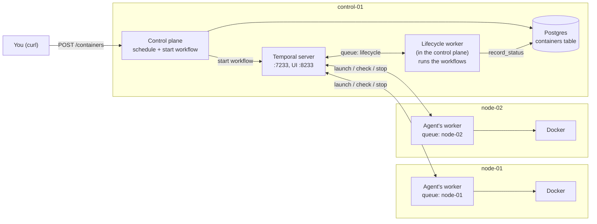

# Managing Container Lifecycles with Temporal

## Overview

In the **Isolating Tenants with a VXLAN Overlay Network** lab you started test containers by hand with `docker run`. A real platform can't work like that. When a tenant asks for a container, the platform must:

1. pick a node with room for it;
2. start it on that node, on the tenant's network;
3. keep checking that it's healthy, for its whole life;
4. stop it when it fails, or when its time is up.

Steps 1 and 2 take seconds. Steps 3 and 4 can span an hour, and a lot can go wrong in an hour. The control plane may restart. A node may die. A "check again in 15 seconds" may be forgotten. If all of this lives in a Python loop inside the control plane, a single restart loses every timer, and containers keep running with nobody watching them.

**Temporal** is built for exactly this. You write the whole lifecycle as one ordinary-looking async function, the **workflow**. Temporal records every step it takes in a database. If the process running it dies, another one picks it up and continues from the same point, timers included.

Think of a patient's care plan in a hospital. The plan says "give this medicine, then check the patient every 15 minutes, and discharge them after two days". It's written in the patient's chart, not in any one nurse's head. Nurses come and go between shifts, but whoever is on duty reads the chart, sees exactly where things stand, and carries on. In this lab:

- the **workflow** is the care plan;
- **Temporal** is the chart: it records every step and every "check again in 15 seconds";
- **workers** are the nurses on duty: processes that read the chart and do the next step;
- **activities** are the actual procedures at the bedside: starting, checking and removing a container on its node.

This lab covers the final exam's "Container Lifecycle Management with Temporal" (launch, monitor health, auto-terminate on failure or TTL) and its requirement that containers are "scheduled through your control plane logic". Every container in the rest of the course is launched this way.

## Architecture



The control plane picks a node and starts a workflow. The workflow runs on a worker inside the control plane. Each time it needs Docker work done, it puts an activity on the chosen node's **task queue** (`node-01` or `node-02`), and that node's agent picks it up and runs it.

## Before you start

### Get AWS credentials

Open **Cloud Tray → Credentials** and copy the **AccessKey** and **SecretKey**. Then:

**workspace**
```bash
aws configure
```

Paste the two keys, enter `ap-southeast-1` as the region, and press Enter for the output format. Confirm AWS accepts them:

**workspace**
```bash
aws sts get-caller-identity
aws ec2 describe-availability-zones --query 'AvailabilityZones[0].ZoneName' --output text
```

The second command must print `ap-southeast-1a`. If it says `AuthFailure`, wait a minute and run it again.

### Get the lab code

**workspace**
```bash
cd ~/code
git clone -b lab-03-start --depth 1 https://github.com/poridhioss/ecs-lab.git
cd ecs-lab && ls
```

<!-- UNTESTED -->
```
agent  control-plane  infra  scripts
```

This branch contains the finished code from the **Isolating Tenants with a VXLAN Overlay Network** lab, plus updated `requirements.txt` files that add the Temporal Python SDK (`temporalio`) to both the control plane and the agent. In this lab you add to `control-plane/main.py` and `agent/agent.py`, and write two new files: `control-plane/workflows.py` and `agent/activities.py`.

### Check for leftovers

**workspace**
```bash
aws ec2 describe-vpcs --filters "Name=tag:Name,Values=ecs-lab-vpc" --query 'Vpcs[].VpcId' --output text
bash scripts/preflight.sh
```

The first command should print nothing, and the second `clean: no leftovers from an earlier session`. If a VPC ID was printed, the script deletes it and everything in it.

## Catch-up

First rebuild where the previous lab ended: the control plane, Postgres, Temporal, an agent on each node, and the `alpha` and `beta` tenant networks on both nodes.

**workspace**
```bash
cd ~/code/ecs-lab/infra/terraform && terraform init && terraform apply -auto-approve
```

When it prints `Apply complete! Resources: 14 added`, run the catch-up script. It waits for the machines to finish installing Docker, deploys everything, creates both tenant networks, and checks the result:

**workspace**
```bash
cd ~/code/ecs-lab && time bash scripts/catchup.sh
```

<!-- UNTESTED -->
```
...
== creating tenant networks ==
{"tenant_id":"alpha","vxlan_id":100,"subnet":"10.10.1.0/24","nodes":{"node-01":[...],"node-02":[...]}}
{"tenant_id":"beta","vxlan_id":200,"subnet":"10.10.2.0/24","nodes":{"node-01":[...],"node-02":[...]}}
== verifying ==
...
== tenant networks ==
ok: node-01 vxlan100 attached to br-alpha, peer set
ok: node-01 vxlan200 attached to br-beta, peer set
ok: node-02 vxlan100 attached to br-alpha, peer set
ok: node-02 vxlan200 attached to br-beta, peer set
ALL CHECKS PASSED
```

Then set the two variables you'll use throughout the lab:

**workspace**
```bash
CONTROL=$(terraform -chdir=infra/terraform output -raw control_public_ip)
TOKEN=$(terraform -chdir=infra/terraform output -raw agent_token)
echo "control plane: $CONTROL"
```

If you open a new terminal later, run these three lines again from `~/code/ecs-lab`.

## Concepts

### Why not a loop in the control plane?

The obvious design is a background task in the control plane: for each container, `while True: check; sleep 15`. It works until something restarts:

- **The control plane restarts** (a deploy, a crash). Every loop is gone. Containers keep running, and nobody checks them or stops them when their time is up.
- **It crashes halfway through a step**, say after starting the container but before writing its ID to the database. Now there's a container nobody knows about.
- **A node stops answering.** Should the loop retry? For how long? Each case needs hand-written code.

Temporal handles all of this for you. Its server records each step of every workflow in its own database. When a worker restarts, Temporal hands it the recorded history, and the workflow continues as if nothing happened.

### Temporal's building blocks

| Piece | What it is | In this lab |
|---|---|---|
| **Server** | Stores every workflow's history and hands out work. | The `temporal` container on `control-01` (port 7233, UI on 8233), running since the first lab. |
| **Workflow** | The plan, written as an async Python function. Must be *deterministic* (see below). | `ContainerLifecycleWorkflow` in `control-plane/workflows.py`: launch, check every 15s, finish. |
| **Activity** | One real piece of work that talks to the outside world. Can fail and be retried. | `launch_container`, `check_container`, `stop_container` (Docker, on a node) and `record_status` (Postgres, on `control-01`). |
| **Task queue** | A named mailbox for work. A worker listens on one queue. | `lifecycle` for the workflows; `node-01` and `node-02` for each node's Docker work. |
| **Worker** | A process that listens on a task queue and runs the workflows or activities registered with it. | One inside the control plane (queue `lifecycle`), one inside each agent (queue = its node ID). |

The task queue is how work reaches the **right machine**. A container scheduled on `node-02` must be started by `node-02`'s Docker, so the workflow sends `launch_container` to the `node-02` queue, where only `node-02`'s agent is listening. The queue is named after the **registered node ID**, not the machine's hostname, so it matches what the control plane's scheduler picked.

### Durable timers and replay

Inside a workflow, `await asyncio.sleep(15)` doesn't just pause Python. Temporal turns it into a **durable timer**: the server records "wake this workflow at 12:00:15". If the control plane is down at 12:00:15, the timer still fires on the server, and the workflow continues as soon as a worker is back.

How does a restarted worker know where a workflow was? It **replays** it: it runs the workflow function again from the top, and for every step already in the history (activity results, timers that fired), Temporal returns the recorded result instead of doing it again. So the function reaches exactly the point it had reached before, without launching the container twice.

Replay only works if the workflow makes the **same decisions** every time it runs. So workflow code must be **deterministic**:

- no direct I/O (no Docker, database or HTTP calls): that's what activities are for;
- no reading the clock with `datetime.now()`: use `workflow.now()`, which returns the recorded time;
- no random numbers.

Temporal checks this for you: it runs workflow code in a sandbox that blocks most of these mistakes.

### Timeouts that detect a dead node

Every activity call needs a timeout, and the kind matters:

- **`start_to_close_timeout`**: how long one attempt may run, *once a worker has picked it up*.
- **`schedule_to_close_timeout`**: how long the whole thing may take, *including waiting in the queue*.

If `node-02` is dead, nothing ever picks up work from the `node-02` queue. A `start_to_close` timeout would never even start counting. A `schedule_to_close` timeout of 10 seconds expires anyway, and the health check fails. That's why the workflow uses `schedule_to_close` for everything it sends to a node.

### Scheduling: where should a container run?

The scheduler uses the free capacity each agent reports in its heartbeats: of the online nodes with enough free CPU and memory, it picks the one with the **most free memory**. This spreads containers across nodes. It's deliberately simple. One flaw to know about: heartbeats arrive every 10 seconds, so two containers requested within a few seconds of each other are judged on the same, slightly stale numbers.

### How long can a workflow live?

Every step adds events to a workflow's history: each health check adds a few, every 15 seconds. Temporal handles histories of tens of thousands of events, but not unlimited ones. A workflow meant to run for days would periodically restart itself with a fresh history, using `workflow.continue_as_new`. This lab caps a container's TTL at one hour, about 240 checks, so its history stays small and `continue_as_new` isn't needed.

## Steps

### Step 1: Connect the control plane to Temporal

Open `control-plane/main.py` in VS Code.

**1a. Imports.** Replace the import lines at the top (from `import asyncio` down to `from pydantic import BaseModel`) with:

```python
import asyncio
import ipaddress
import logging
import os
import re
import secrets
from contextlib import asynccontextmanager

import httpx
import psycopg
from fastapi import Depends, FastAPI, Header, HTTPException
from psycopg.rows import dict_row
from pydantic import BaseModel, Field
from temporalio import activity
from temporalio.client import Client
from temporalio.worker import Worker

from workflows import ContainerLifecycleWorkflow, ContainerSpec
```

New: `Field` to validate request values, the Temporal client and worker, and `workflows`, the file you'll write in Step 2.

**1b. The containers table.** Inside the `SCHEMA` string, after the closing `);` of the `tenants` table and before the closing `"""`, add:

```python

CREATE TABLE IF NOT EXISTS containers (
    container_id TEXT PRIMARY KEY,
    tenant_id    TEXT NOT NULL REFERENCES tenants (tenant_id),
    node_id      TEXT NOT NULL,
    image        TEXT NOT NULL,
    cpu          REAL NOT NULL,
    mem_mb       INTEGER NOT NULL,
    ttl_seconds  INTEGER NOT NULL,
    status       TEXT NOT NULL,      -- pending, running, failed, expired
    ip           TEXT,
    reason       TEXT,               -- why it ended
    created_at   TIMESTAMPTZ NOT NULL DEFAULT now(),
    updated_at   TIMESTAMPTZ NOT NULL DEFAULT now()
);
```

One row per container. `REFERENCES tenants` means a container can only belong to a tenant that exists. `status` moves from `pending` to `running`, then ends as `failed` or `expired`, and `reason` says why.

**1c. Start a Temporal client and worker.** Replace the whole `lifespan` function (from `@asynccontextmanager` down to `task.cancel()`) with:

```python
TEMPORAL_ADDRESS = "localhost:7233"   # Temporal runs on this machine (Docker Compose)
LIFECYCLE_QUEUE = "lifecycle"         # the task queue our workflows run on


@asynccontextmanager
async def lifespan(app):
    with db() as conn:
        conn.execute(SCHEMA)
    # If Temporal isn't up yet, this raises, the service exits, and systemd restarts it.
    app.state.temporal = await Client.connect(TEMPORAL_ADDRESS)
    # This worker runs the lifecycle workflows, plus the one activity that writes to our database.
    worker = Worker(
        app.state.temporal,
        task_queue=LIFECYCLE_QUEUE,
        workflows=[ContainerLifecycleWorkflow],
        activities=[record_status],
    )
    tasks = [asyncio.create_task(offline_checker()), asyncio.create_task(worker.run())]
    yield
    for task in tasks:
        task.cancel()
```

At startup the control plane now connects to Temporal, keeps the client in `app.state.temporal` (the endpoint uses it to start workflows), and runs a worker on the `lifecycle` queue alongside the offline checker. `record_status` is the activity you'll add at the end of the file in Step 3.

Save the file.

### Step 2: Write the workflow

Create a new file **`control-plane/workflows.py`**. Paste each part at the end of the file.

**Part 1: settings and the container's description.**

```python
"""The container lifecycle, as a Temporal workflow.

The workflow is the *plan*: launch the container, check its health every few
seconds until it fails or its time is up, then clean up. Temporal records every
step, so if the control plane restarts halfway, the workflow carries on exactly
where it was, timers included. The *work* (Docker calls) happens in activities,
which run on the agent of the node the container was scheduled on.
"""
import asyncio
from dataclasses import dataclass
from datetime import timedelta

from temporalio import workflow
from temporalio.common import RetryPolicy
from temporalio.exceptions import ActivityError

CHECK_EVERY = 15        # seconds between health checks
MAX_FAILED_CHECKS = 3   # this many failed checks in a row means the container has failed


@dataclass
class ContainerSpec:
    container_id: str
    tenant_id: str
    node_id: str
    image: str
    command: list[str] | None
    cpu: float
    mem_mb: int
    ttl_seconds: int
```

`ContainerSpec` is everything the workflow needs to know about one container. Temporal stores it in the workflow's history as JSON, and passes it to activities the same way.

**Part 2: the plan.**

```python


@workflow.defn
class ContainerLifecycleWorkflow:
    @workflow.run
    async def run(self, spec: ContainerSpec) -> str:
        # 1. Launch on the chosen node. Activities are called by name, on the node's
        #    task queue, so only that node's agent picks them up.
        try:
            launched = await workflow.execute_activity(
                "launch_container", spec,
                task_queue=spec.node_id,
                schedule_to_close_timeout=timedelta(minutes=3),  # includes pulling the image
                retry_policy=RetryPolicy(maximum_attempts=3),
            )
        except ActivityError as e:
            return await self.finish(spec, "failed", f"launch failed: {e.cause}")
        await self.record(spec, "running", ip=launched["ip"])

        # 2. Watch it until its time is up, or until it fails.
        deadline = workflow.now() + timedelta(seconds=spec.ttl_seconds)
        failed_checks = 0
        while workflow.now() < deadline:
            seconds_left = (deadline - workflow.now()).total_seconds()
            await asyncio.sleep(min(CHECK_EVERY, seconds_left))  # a durable timer
            if workflow.now() >= deadline:
                break
            if await self.is_healthy(spec):
                failed_checks = 0
            else:
                failed_checks += 1
                if failed_checks >= MAX_FAILED_CHECKS:
                    return await self.finish(spec, "failed", f"{MAX_FAILED_CHECKS} failed health checks in a row")

        # 3. Time's up.
        return await self.finish(spec, "expired", f"TTL of {spec.ttl_seconds}s reached")
```

Read it as the plan it is:

1. **Launch.** `execute_activity("launch_container", spec, task_queue=spec.node_id, ...)` puts the work on the chosen node's queue and waits for the result, the container's IP. The activity is named by a string because its code lives in the agent, on another machine. If the launch fails three times (a bad image name, for example), the container is recorded as `failed`.
2. **Watch.** Sleep (a durable timer), check, repeat, until the deadline. One failed check could be a blip, so it takes `MAX_FAILED_CHECKS` failures *in a row* to declare the container dead; a healthy check resets the count. The last sleep is shortened so the workflow wakes exactly at the deadline.
3. **Finish.** When the TTL is reached, stop the container and record `expired`.

Notice what isn't here: no retry loops, no saving progress, no recovery code. Temporal takes care of all that.

**Part 3: the helpers.**

```python

    async def is_healthy(self, spec):
        try:
            health = await workflow.execute_activity(
                "check_container", spec.container_id,
                task_queue=spec.node_id,
                schedule_to_close_timeout=timedelta(seconds=10),  # a dead node never answers
                retry_policy=RetryPolicy(maximum_attempts=1),     # a failed check is a result, not an error
            )
        except ActivityError:
            workflow.logger.warning("health check for %s got no answer from %s", spec.container_id, spec.node_id)
            return False
        return health["healthy"]

    async def finish(self, spec, status, reason):
        """Remove the container (if its node answers) and record how it ended."""
        try:
            await workflow.execute_activity(
                "stop_container", spec.container_id,
                task_queue=spec.node_id,
                schedule_to_close_timeout=timedelta(seconds=30),
            )
        except ActivityError:
            reason += " (node did not answer, container not removed)"
        await self.record(spec, status, reason=reason)
        return status

    async def record(self, spec, status, ip=None, reason=None):
        # No task_queue: this activity runs on the workflow's own queue, on control-01.
        await workflow.execute_activity(
            "record_status",
            {"container_id": spec.container_id, "status": status, "ip": ip, "reason": reason},
            start_to_close_timeout=timedelta(seconds=10),
        )
```

- **`is_healthy`** asks the node. A health check isn't retried: if it fails, that *is* the answer. If the node doesn't answer within 10 seconds (dead, or its agent stopped), that counts as a failed check too, which is how a container on a dead node eventually gets marked `failed`.
- **`finish`** removes the container, and records the outcome even if the node can't be reached.
- **`record`** writes the status to Postgres. The workflow can't do that itself (no I/O in workflows), so it calls the `record_status` activity on its own queue, `lifecycle`, where the control plane's worker runs it.

Save the file.

### Step 3: Schedule containers and start workflows

Back in `control-plane/main.py`, add this at the end of the file:

```python


# ---------- containers ----------

class ContainerRequest(BaseModel):
    tenant_id: str
    image: str
    command: list[str] | None = None              # None = the image's default command
    cpu: float = Field(0.25, gt=0, le=2)          # CPUs
    mem_mb: int = Field(64, ge=6, le=2048)        # memory limit, MiB
    ttl_seconds: int = Field(300, gt=0, le=3600)  # stop the container after this long


def schedule(cpu, mem_mb):
    """The online node with the most free memory that still fits the request."""
    with db() as conn:
        candidates = conn.execute(
            """SELECT node_id FROM agents
               WHERE status = 'online' AND cpu_free >= %s AND mem_free >= %s
               ORDER BY mem_free DESC""",
            (cpu, mem_mb * 1024 * 1024),
        ).fetchall()
    candidates = [c["node_id"] for c in candidates if c["node_id"] in NODE_SLOTS]
    if not candidates:
        raise HTTPException(status_code=409, detail="no online node has enough free CPU and memory")
    return candidates[0]


def prepare_container(req):
    """Check the tenant, pick a node, and record the container as pending."""
    with db() as conn:
        if not conn.execute("SELECT 1 FROM tenants WHERE tenant_id = %s", (req.tenant_id,)).fetchone():
            raise HTTPException(status_code=404, detail=f"tenant {req.tenant_id} has no network yet")
    spec = ContainerSpec(
        container_id=f"{req.tenant_id}-{secrets.token_hex(4)}",  # e.g. alpha-3f9a1c2e
        node_id=schedule(req.cpu, req.mem_mb),
        **req.model_dump(),
    )
    with db() as conn:
        conn.execute(
            """INSERT INTO containers (container_id, tenant_id, node_id, image, cpu, mem_mb, ttl_seconds, status)
               VALUES (%s, %s, %s, %s, %s, %s, %s, 'pending')""",
            (spec.container_id, spec.tenant_id, spec.node_id, spec.image, spec.cpu, spec.mem_mb, spec.ttl_seconds),
        )
    return spec
```

- **`ContainerRequest`** describes what a user may ask for. `Field(..., gt=0, le=2)` sets limits: FastAPI rejects a request outside them with `422` before your code runs. The TTL limit of 3600 seconds keeps workflow histories small, as explained in the Concepts section.
- **`schedule`** is the scheduler: `ORDER BY mem_free DESC` puts the node with the most free memory first, among online nodes with enough room. `409 Conflict` means "valid request, but no room right now".
- **`prepare_container`** checks that the tenant has a network, picks a node, gives the container an ID with the tenant's name in it (`alpha-3f9a1c2e`), and inserts the `pending` row. `**req.model_dump()` copies the request's fields (`tenant_id`, `image`, ...) into the `ContainerSpec`.

Now the endpoints and the activity, also at the end of the file:

```python


@app.post("/containers", status_code=201)
async def create_container(req: ContainerRequest):
    spec = await asyncio.to_thread(prepare_container, req)  # database work, off the event loop
    workflow_id = f"container-{spec.container_id}"
    # Start the lifecycle and return at once: the workflow carries on without us.
    await app.state.temporal.start_workflow(
        ContainerLifecycleWorkflow.run, spec, id=workflow_id, task_queue=LIFECYCLE_QUEUE,
    )
    log.info("container %s scheduled on %s (workflow %s)", spec.container_id, spec.node_id, workflow_id)
    return {"container_id": spec.container_id, "node_id": spec.node_id, "status": "pending", "workflow_id": workflow_id}


@app.get("/containers")
def list_containers(tenant_id: str | None = None):
    with db() as conn:
        return conn.execute(
            """SELECT container_id, tenant_id, node_id, image, status, ip, reason, created_at, updated_at
               FROM containers
               WHERE %(tenant_id)s::text IS NULL OR tenant_id = %(tenant_id)s
               ORDER BY created_at""",
            {"tenant_id": tenant_id},
        ).fetchall()


@activity.defn
async def record_status(update: dict) -> None:
    """Run by the lifecycle workflow (on control-01) to keep the containers table current."""
    def write():
        with db() as conn:
            conn.execute(
                """UPDATE containers
                   SET status = %(status)s, ip = COALESCE(%(ip)s::text, ip),
                       reason = %(reason)s, updated_at = now()
                   WHERE container_id = %(container_id)s""",
                update,
            )
    await asyncio.to_thread(write)
    log.info("container %s is %s%s", update["container_id"], update["status"],
             f": {update['reason']}" if update["reason"] else "")
```

- **`POST /containers`** is `async` because starting a workflow is an async Temporal call. The database part runs on a thread (`asyncio.to_thread`) so it doesn't block the event loop, which the Temporal worker shares. `start_workflow` returns as soon as Temporal has recorded the workflow: the response says `pending` straight away, and the workflow takes it from there. The workflow ID contains the container ID, so you can find it in the Temporal UI.
- **`GET /containers`** lists containers, optionally only one tenant's (`?tenant_id=alpha`). The `%(tenant_id)s::text IS NULL OR ...` trick means "no filter when no tenant is given".
- **`record_status`** is an activity like any other, but it lives in the control plane because it needs the database. `COALESCE(new_ip, ip)` keeps the IP recorded at launch when later updates don't include one.

Save the file.

### Step 4: Write the container activities

The agent does the Docker work. Create a new file **`agent/activities.py`**:

```python
"""Container operations: the activities this node's Temporal worker runs.

The lifecycle workflow (on control-01) decides *what* happens and *when*;
these functions do the actual Docker work on this node. Each one is safe to
run again, because Temporal retries an activity if it fails or times out.
"""
import os

import docker
from temporalio import activity

NODE_ID = os.environ["NODE_ID"]
client = docker.from_env()


@activity.defn
def launch_container(spec: dict) -> dict:
    """Start the container on its tenant's network. A retry reuses an existing one."""
    name = spec["container_id"]
    try:
        container = client.containers.get(name)
    except docker.errors.NotFound:
        container = client.containers.run(
            spec["image"],
            spec["command"],
            name=name,
            detach=True,                         # start it and return; don't wait for it to finish
            network=spec["tenant_id"],           # the tenant's Docker network from the VXLAN lab
            labels={"tenant_id": spec["tenant_id"], "node_id": NODE_ID, "container_id": name},
            mem_limit=f"{spec['mem_mb']}m",
            nano_cpus=int(spec["cpu"] * 1_000_000_000),  # 1 CPU = 10^9 nano-CPUs
        )
    container.reload()  # refresh, so the network settings include the assigned IP
    ip = container.attrs["NetworkSettings"]["Networks"][spec["tenant_id"]]["IPAddress"]
    activity.logger.info("launched %s on %s at %s", name, NODE_ID, ip)
    return {"ip": ip}


@activity.defn
def check_container(container_id: str) -> dict:
    """Is the container still running? A missing container counts as unhealthy."""
    try:
        state = client.containers.get(container_id).attrs["State"]
    except docker.errors.NotFound:
        return {"healthy": False, "state": "missing"}
    return {"healthy": state["Running"], "state": state["Status"], "exit_code": state["ExitCode"]}


@activity.defn
def stop_container(container_id: str) -> str:
    """Stop and remove the container. Already gone counts as done."""
    try:
        container = client.containers.get(container_id)
    except docker.errors.NotFound:
        return "already gone"
    container.stop(timeout=5)  # SIGTERM, then SIGKILL after 5 seconds
    container.remove()
    activity.logger.info("removed %s", container_id)
    return "removed"
```

- **`launch_container`** starts the container with Docker's Python SDK: `network=` puts it on the tenant's network from the previous lab (so it gets an address from this node's half of the tenant subnet), `labels` tag it with its tenant, node and ID, and `mem_limit` / `nano_cpus` enforce the requested resources. If the image isn't on the node yet, Docker downloads it first.
- **Safe to retry.** Temporal retries an activity that fails or times out, so each activity checks before acting, just like the network setup in the previous lab. If a first attempt started the container but the reply was lost, the retry finds the container by its name and doesn't start a second one.
- These are plain functions, not `async`: the Docker SDK blocks while it waits. The agent's worker runs them on a pool of threads.

Save the file.

### Step 5: Run a Temporal worker in the agent

Open `agent/agent.py`.

**5a. Imports.** Replace the import lines at the top (from `import asyncio` down to `import network`) with:

```python
import asyncio
import logging
import os
import secrets
import socket
from concurrent.futures import ThreadPoolExecutor

import httpx
import psutil
import uvicorn
from fastapi import Depends, FastAPI, Header, HTTPException
from pydantic import BaseModel
from temporalio.client import Client
from temporalio.worker import Worker

import activities
import network
```

**5b. The worker.** Replace the whole `main` function (from `async def main():` down to `beating.cancel()`) with:

```python
async def temporal_worker():
    """Run container operations that the lifecycle workflows send to this node's task queue."""
    while True:
        try:
            client = await Client.connect(f"{os.environ['CONTROL_IP']}:7233")
            break
        except Exception as e:
            log.warning("Temporal not reachable (%s), retrying in 5s", e)
            await asyncio.sleep(5)
    worker = Worker(
        client,
        task_queue=NODE_ID,  # the registered node ID, e.g. node-01: never the hostname
        activities=[activities.launch_container, activities.check_container, activities.stop_container],
        activity_executor=ThreadPoolExecutor(max_workers=8),  # the activities are plain (blocking) functions
    )
    log.info("Temporal worker polling task queue %s", NODE_ID)
    await worker.run()


async def main():
    # Three jobs in one process: heartbeats and the Temporal worker in the background, the API in front.
    background = [asyncio.create_task(heartbeats()), asyncio.create_task(temporal_worker())]
    server = uvicorn.Server(uvicorn.Config(api, host="0.0.0.0", port=AGENT_PORT, log_level="warning"))
    await server.serve()  # runs until the service is stopped
    for task in background:
        task.cancel()
```

The agent connects to Temporal on `control-01`'s private IP (port 7233 is open between the cluster's machines) and listens on the queue named after its node ID. If Temporal isn't reachable yet, it keeps retrying instead of crashing, so heartbeats keep flowing. The agent now runs three jobs in one process: heartbeats, the network API, and the Temporal worker.

Save the file.

### Step 6: Deploy

**workspace**
```bash
bash scripts/push.sh control-plane && bash scripts/push.sh agent
```

<!-- UNTESTED -->
```
==> copied control-plane to control-01
waiting for the control plane on :8000 ...
control plane is up
==> copied agent to node-01
agent (re)started on node-01; logs: journalctl -u agent -f
==> copied agent to node-02
agent (re)started on node-02; logs: journalctl -u agent -f
```

Check that each agent's worker is listening on its queue:

**workspace**
```bash
ssh node-01 'journalctl -u agent -n 5 --no-pager'
ssh node-02 'journalctl -u agent -n 5 --no-pager'
```

<!-- UNTESTED -->
```
... INFO registered as node-01 (10.0.1.21 via ens5)
... INFO Temporal worker polling task queue node-01
... INFO registered as node-02 (10.0.1.22 via ens5)
... INFO Temporal worker polling task queue node-02
```

### Step 7: Launch a container and watch its life

This block asks for an `alpha` container with a 90-second TTL. It waits until the container is `running`, shows it on its node, then watches its status until it expires. The container runs a small shell loop that prints a line every 5 seconds (the next lab collects those lines).

**workspace**
```bash
R=$(curl -sS -X POST http://$CONTROL:8000/containers -H "Content-Type: application/json" \
  -d '{"tenant_id": "alpha", "image": "busybox:1.37",
       "command": ["sh", "-c", "while true; do echo hello from alpha; sleep 5; done"],
       "ttl_seconds": 90}')
echo "$R" | jq -c
ID=$(echo "$R" | jq -r .container_id); NODE=$(echo "$R" | jq -r .node_id)
row() { curl -sS "http://$CONTROL:8000/containers?tenant_id=alpha" | jq -r --arg id "$ID" '.[] | select(.container_id == $id) | "\(.status)  \(.node_id)  \(.ip // "-")  \(.reason // "")"'; }
until row | grep -q '^running'; do sleep 2; done
echo "--- on $NODE:"
ssh $NODE 'docker ps --filter label=tenant_id --format "table {{.Names}}\t{{.Status}}\t{{.Label \"tenant_id\"}}"'
echo "--- status every 5s:"
for i in $(seq 24); do row; sleep 5; done
```

What's new here:

- `-H "Content-Type: application/json"` tells the API the body is JSON, and `-d` is the body itself. `ID` and `NODE` save the new container's ID and node for the next commands.
- `row` is a small shell function that prints this container's line: `select(.container_id == $id)` keeps only its row, and `.ip // "-"` prints `-` while the IP is still empty. The `until` loop calls it every 2 seconds until the status is `running`.
- `docker ps` lists running containers on the node: `--filter label=tenant_id` shows only the platform's (the ones with that label), and `--format` picks the columns.

<!-- UNTESTED -->
```
{"container_id":"alpha-3f9a1c2e","node_id":"node-02","status":"pending","workflow_id":"container-alpha-3f9a1c2e"}
--- on node-02:
NAMES            STATUS                  TENANT_ID
alpha-3f9a1c2e   Up Less than a second   alpha
--- status every 5s:
running  node-02  10.10.1.130
running  node-02  10.10.1.130
...
running  node-02  10.10.1.130
expired  node-02  10.10.1.130  TTL of 90s reached
expired  node-02  10.10.1.130  TTL of 90s reached
```

The container went from `pending` to `running` within a few seconds, on the scheduled node, with an IP from that node's half of `alpha`'s subnet. After 90 seconds the workflow stopped it and recorded `expired`. Nobody had to watch it. Run the `ssh $NODE 'docker ps ...'` line again now: the list is empty, because the workflow removed the container.

Now look at the same container in the **Temporal UI**. Open `http://CONTROL_IP:8233` in your browser (`echo $CONTROL` prints the IP). Click the workflow `container-alpha-...`. Its **Event History** is the "chart" from the Overview: the `launch_container` activity, then a `TimerStarted` / `TimerFired` pair and a `check_container` activity every 15 seconds, and finally `stop_container`, `record_status` and `WorkflowExecutionCompleted`. Click an activity to see its input and result, such as the IP `launch_container` returned.

### Step 8: Restart the control plane mid-life

This is what Temporal is for. Launch a container with a 2-minute TTL, restart the whole control plane (and with it the workflow worker) while the container is running, and watch the lifecycle carry on:

**workspace**
```bash
R=$(curl -sS -X POST http://$CONTROL:8000/containers -H "Content-Type: application/json" \
  -d '{"tenant_id": "beta", "image": "busybox:1.37", "command": ["sleep", "3600"], "ttl_seconds": 120}')
ID=$(echo "$R" | jq -r .container_id); echo "launched $ID"
until curl -sS "http://$CONTROL:8000/containers" | jq -e --arg id "$ID" '.[] | select(.container_id == $id and .status == "running")' >/dev/null; do sleep 2; done
ssh control-01 'sudo systemctl restart control-plane' && echo ">>> control plane restarted"
for i in $(seq 30); do
  curl -sS "http://$CONTROL:8000/containers?tenant_id=beta" \
    | jq -r --arg id "$ID" '.[] | select(.container_id == $id) | "\(.status)  \(.reason // "")"'
  sleep 5
done
```

`jq -e` sets its exit code from the result (success only if a matching row exists), so the `until` loop repeats until the container shows `running`. While the control plane restarts, a few `curl` calls fail with `Connection refused`; that's expected.

<!-- UNTESTED -->
```
launched beta-8c21d4e0
>>> control plane restarted
curl: (7) Failed to connect to 52.77.x.x port 8000 ...
running
running
...
expired  TTL of 120s reached
```

The control plane process, including the worker running the workflow, was killed and started again. The workflow didn't start over, didn't launch a second container, and still expired the container on time. While the control plane was down, its timers kept firing on the Temporal server. When the new worker started, Temporal replayed the workflow's history to it, and it carried on.

## Break it on purpose

Kill a container behind the platform's back, and watch the workflow notice. This block launches a container with a 5-minute TTL, waits until it's `running`, kills it directly with Docker on its node, and watches:

**workspace**
```bash
R=$(curl -sS -X POST http://$CONTROL:8000/containers -H "Content-Type: application/json" \
  -d '{"tenant_id": "alpha", "image": "busybox:1.37", "command": ["sleep", "3600"], "ttl_seconds": 300}')
ID=$(echo "$R" | jq -r .container_id); NODE=$(echo "$R" | jq -r .node_id); echo "launched $ID on $NODE"
until curl -sS "http://$CONTROL:8000/containers" | jq -e --arg id "$ID" '.[] | select(.container_id == $id and .status == "running")' >/dev/null; do sleep 2; done
ssh $NODE "docker kill $ID" && echo ">>> killed $ID"
for i in $(seq 14); do
  curl -sS "http://$CONTROL:8000/containers" \
    | jq -r --arg id "$ID" '.[] | select(.container_id == $id) | "\(.status)  \(.reason // "")"'
  sleep 5
done
```

`docker kill` stops the container immediately, without asking the platform.

<!-- UNTESTED -->
```
launched alpha-5b7e90aa on node-01
>>> killed alpha-5b7e90aa
running
running
...
failed  3 failed health checks in a row
```

For up to 45 seconds the status still says `running`: the workflow only learns about the kill at its next health check, and it waits for three failed checks in a row before giving up. Then it records `failed` with the reason, and removes the dead container. In the Temporal UI, this workflow's history shows three `check_container` results with `"healthy": false`.

Three checks at 15-second intervals is a trade-off: a container is declared dead 30 to 45 seconds after it dies, but a single slow check doesn't kill a healthy container. Change `CHECK_EVERY` or `MAX_FAILED_CHECKS` in `workflows.py` to tune it.

## Verification

This block runs one container through its full life, with a 30-second TTL, and checks each stage:

**workspace**
```bash
R=$(curl -sS -X POST http://$CONTROL:8000/containers -H "Content-Type: application/json" \
  -d '{"tenant_id": "beta", "image": "busybox:1.37", "command": ["sleep", "3600"], "ttl_seconds": 30}')
ID=$(echo "$R" | jq -r .container_id); NODE=$(echo "$R" | jq -r .node_id)
status() { curl -sS "http://$CONTROL:8000/containers" | jq -r --arg id "$ID" '.[] | select(.container_id == $id) | .status'; }
echo "1. scheduled $ID on $NODE"
until [ "$(status)" = running ]; do sleep 2; done
echo "2. running; on $NODE: $(ssh $NODE "docker ps -q --filter name=$ID" | wc -l) container"
until [ "$(status)" = expired ]; do sleep 2; done
echo "3. expired; on $NODE: $(ssh $NODE "docker ps -aq --filter name=$ID" | wc -l) containers left"
curl -sS http://$CONTROL:8000/containers | jq -r '.[] | "\(.container_id)  \(.status)  \(.reason // "")"'
```

`docker ps -q` prints only container IDs, and `wc -l` counts them. `-a` includes stopped containers, so `0` means it's really gone.

<!-- UNTESTED -->
```
1. scheduled beta-0d4f7c19 on node-01
2. running; on node-01: 1 container
3. expired; on node-01: 0 containers left
alpha-3f9a1c2e  expired  TTL of 90s reached
beta-8c21d4e0  expired  TTL of 120s reached
alpha-5b7e90aa  failed  3 failed health checks in a row
beta-0d4f7c19  expired  TTL of 30s reached
```

You're done when:

- `POST /containers` schedules a container on a node and returns at once with `pending`;
- the container becomes `running` with an IP from its tenant's subnet, and ends `expired` when its TTL is reached, removed from its node;
- a killed container ends `failed` after three failed health checks;
- a control-plane restart doesn't interrupt a container's lifecycle;
- every container's history is visible in the Temporal UI.

## Troubleshooting

| Symptom | Cause and fix |
|---|---|
| A `curl` command prints nothing, or `URL rejected` / `Could not resolve host` | `$CONTROL` is empty because you're in a new terminal. From `~/code/ecs-lab`, rerun the `CONTROL=` and `TOKEN=` lines from the end of **Catch-up**. |
| `push.sh control-plane` ends with `control plane did not come up` | Read the error: `ssh control-01 'journalctl -u control-plane -n 30 --no-pager'`. `ModuleNotFoundError: No module named 'workflows'` means `workflows.py` isn't in `control-plane/`. |
| The control-plane log shows a `RestrictedWorkflowAccessError` or `nondeterminism` error | The workflow does something it may not (I/O, `datetime.now()`, random). Compare `workflows.py` with the lab's version. |
| `POST /containers` returns `404 tenant alpha has no network yet` | The tenant networks weren't created. Run `curl -sS -X POST http://$CONTROL:8000/tenants/alpha/network`, and the same for `beta`. |
| `POST /containers` returns `409 no online node has enough free CPU and memory` | Check `curl -sS http://$CONTROL:8000/agents | jq` for online nodes and their free capacity, or ask for less `cpu` / `mem_mb`. |
| `POST /containers` returns `422` | A value is outside its limits: `cpu` up to 2, `mem_mb` 6 to 2048, `ttl_seconds` 1 to 3600. The response says which field. |
| Status stays `pending` | The node's worker didn't run `launch_container`. Check `ssh $NODE 'journalctl -u agent -n 30 --no-pager'` for `Temporal worker polling task queue ...`. If it never appears, the agent can't reach Temporal on `10.0.1.10:7233`. After 3 minutes the workflow gives up and records `failed`. |
| Status `failed`, reason `launch failed: ...` | The reason holds Docker's error. For example, `network alpha not found` means that node has no tenant network: re-send `POST /tenants/alpha/network`. |
| Your code behaves differently from the lab | Compare with the reference: `git fetch --depth 1 origin lab-03-solution && git diff FETCH_HEAD -- control-plane agent` |

## Cleanup

Make sure you're on the workspace (`hostname` prints a random string, not a node name), then delete everything:

**workspace**
```bash
hostname
cd ~/code/ecs-lab && bash scripts/destroy.sh
```

Any containers still running disappear with the machines. Their workflows would be stuck waiting for nodes that no longer exist, but Temporal's own data goes too, so nothing is left behind. The output must end with three empty lists:

<!-- UNTESTED -->
```
Destroy complete! Resources: 14 destroyed.
== leftover check: all three lists should be empty ==
running instances:
ecs-lab VPCs:
ecs-lab key pairs:
```

## Summary

You turned container launching into a managed, durable lifecycle:

- **`POST /containers`** validates the request, **schedules** the container on the online node with the most free memory, records it, and starts a workflow;
- **`ContainerLifecycleWorkflow`** launches the container on its node, checks its health every 15 seconds with **durable timers**, and ends it as `failed` (three failed checks in a row) or `expired` (TTL reached), removing it either way;
- each node's agent runs a **Temporal worker** on a task queue named after its node ID, doing the Docker work as retry-safe **activities**;
- the lifecycle **survives control-plane restarts**, because Temporal records every step and replays it to a new worker.

Containers now come and go on their own, but what they *print* disappears with them. In the next lab, **Centralized Logging with Fluent Bit and Elasticsearch**, every container's output is collected from both nodes into one searchable store, tagged with its tenant, container and node.
